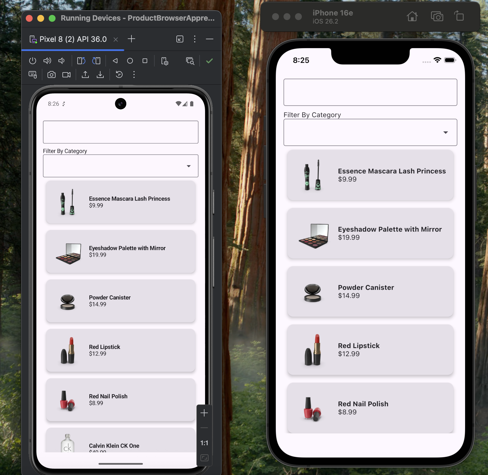
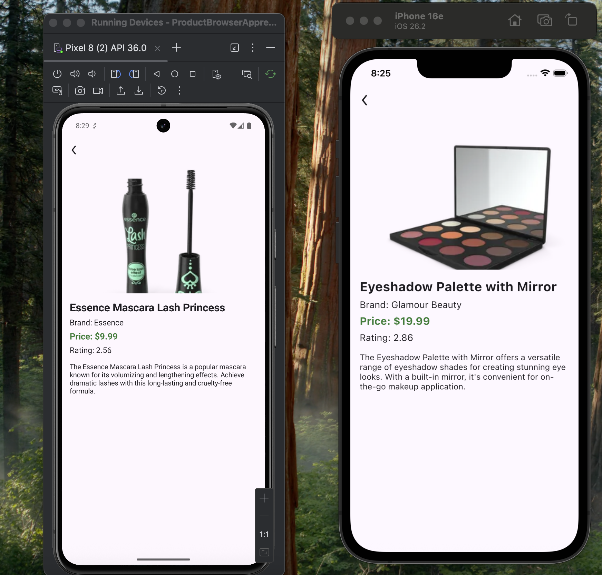

# 📦 Product Browser App (Compose Multiplatform)

A **Product Browser Application** built using **Kotlin, Compose Multiplatform, Ktor, and Clean Architecture**.

The application fetches product data from the **DummyJSON API** and allows users to:

* Browse products
* Search products
* Filter products by category
* View product details

The project demonstrates **modern Android / Kotlin Multiplatform architecture** with clean separation of concerns.

---

# ✨ Features

### 🛍 Product Listing

Users can view a list of products displaying:

* Product thumbnail
* Product title
* Product price

---

### 🔎 Search Products

Users can search products using a search field.

The search is implemented using:

```text
Flow
Debounce
distinctUntilChanged
```

This prevents unnecessary API calls.

---

### 🏷 Category Filtering

Users can filter products by category using a dropdown.

Example categories:

* Beauty
* Furniture
* Groceries
* Fragrances

---

### 📄 Product Details

When a product is selected, users can view detailed information including:

* Product image
* Title
* Brand
* Price
* Rating
* Description

---

# 🧱 Architecture

The project follows **Clean Architecture**.

```text
UI Layer
   ↓
ViewModel
   ↓
UseCase (Business Logic)
   ↓
Repository
   ↓
API Service
```

### Benefits

* Separation of concerns
* Easier testing
* Scalable architecture
* Clean state management

---

# 📁 Project Structure

```text
composeApp
└── src
    └── commonMain
        ├── composeResources
        │   └── drawable
        │
        └── kotlin
            └── com.shouvick.productbrowserapprevest

                ├── commonWidget
                │   └── CustomInputFieldWithDropdown
                │
                ├── core
                │   ├── di
                │   │   └── createKoinConfiguration
                │   │
                │   ├── logging
                │   │
                │   └── network
                │       ├── di
                │       ├── networkResponseHandler
                │       └── HttpClientFactory
                │
                ├── feature
                │   └── product
                │
                │       ├── data
                │       │   ├── apiService
                │       │   ├── di
                │       │   ├── models
                │       │   └── repository
                │       │
                │       ├── domain
                │       │   ├── di
                │       │   ├── repository
                │       │   └── useCases
                │       │
                │       └── ui
                │           ├── di
                │           ├── home
                │           │   ├── HomeScreen.kt
                │           │   └── HomeViewModel.kt
                │           │
                │           └── productDetails
                │               ├── ProductDetailsScreen.kt
                │               └── ProductDetailsViewModel.kt
                │
                ├── navigation
                │   ├── Navigation.kt
                │   └── Routes.kt
                │
                └── App.kt
```

---

# 🌐 API

The app uses **DummyJSON API**.

Base URL:

```text
https://dummyjson.com
```

### Endpoints Used

| Feature                  | Endpoint                        |
| ------------------------ | ------------------------------- |
| Get all products         | `/products`                     |
| Search products          | `/products/search?q=query`      |
| Get product by ID        | `/products/{id}`                |
| Get categories           | `/products/categories`          |
| Get products by category | `/products/category/{category}` |

---

# 🧠 State Management

State is handled using **StateFlow**.

Example UI state:

```kotlin
HomeState(
    allProducts,
    allCategory,
    searchValue,
    selectedCategory,
    isLoading,
    errorMessage
)
```

This allows reactive UI updates.

---

# ⚙️ Dependency Injection

The project uses **Koin** for dependency injection.

Koin provides:

* ViewModels
* UseCases
* Repositories
* API services

---

# 📱 UI Implementation

UI is built using **Jetpack Compose Multiplatform**.

### Screens

**Home Screen**

* Product list
* Search field
* Category filter

**Product Details Screen**

* Product image
* Title
* Brand
* Price
* Rating
* Description

---

# 📸 Screenshots

## Screenshots

### Home Screen


### Product Details


Example:

```text
Home Screen
Product List
Product Details Screen
```

---

# 🚀 Running the Project

### Android

Open the project in **Android Studio** and run:

```
composeApp
```

---

### iOS

Run the generated **Xcode project** from:

```
iosMain
```

---

# 📦 Libraries Used

* Kotlin
* Compose Multiplatform
* Ktor Client
* Koin (Dependency Injection)
* Kotlin Coroutines
* StateFlow
* Coil (Image Loading)

---

# 🔮 Future Improvements

Possible improvements:

* Pagination support
* Pull to refresh
* Offline caching
* Product favorites
* Improved UI animations
* UI testing

---

# 👨‍💻 Author

**Shouvick Bachhar**

Android & Kotlin Developer
